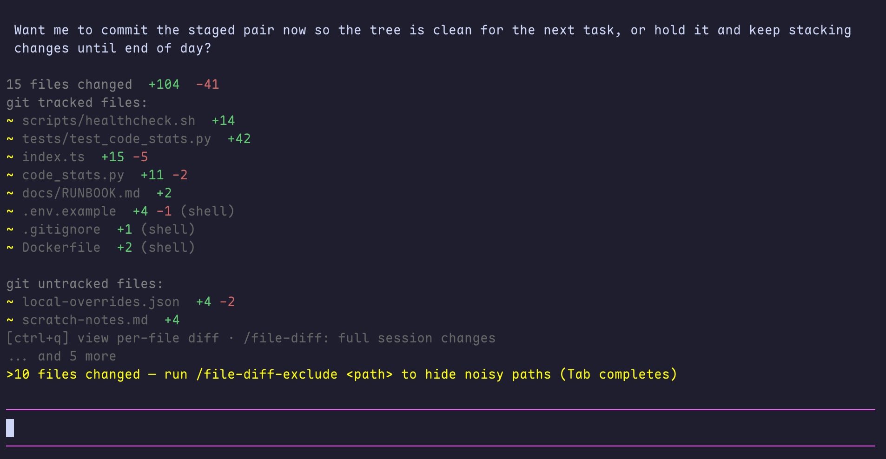
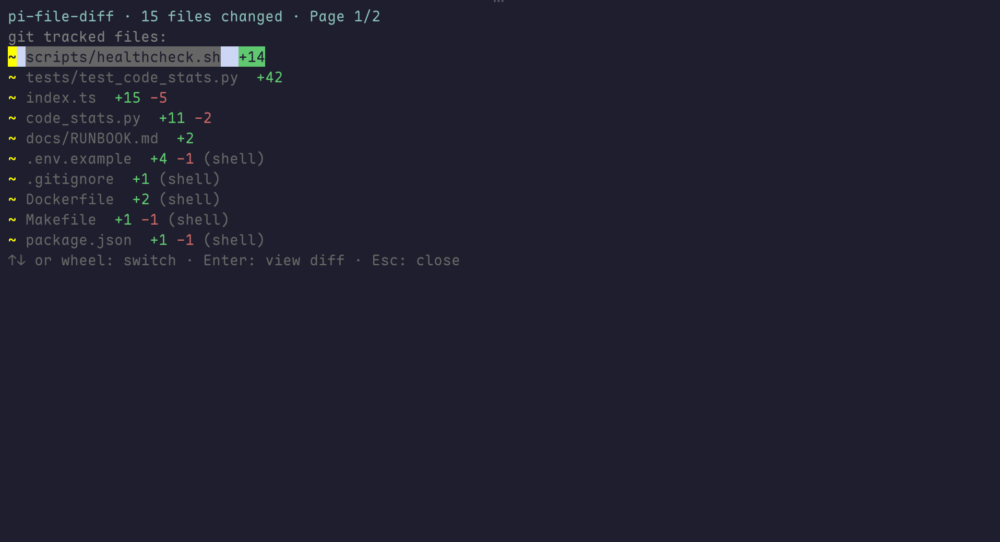
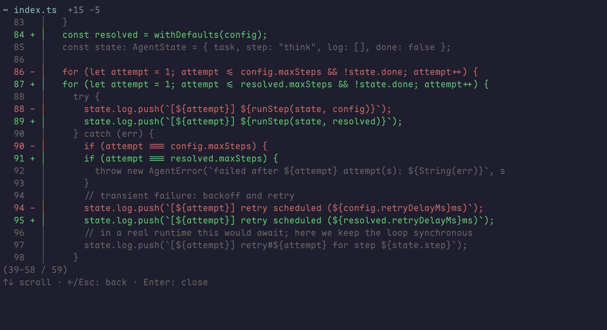

# pi-file-diff

<p align="center">
  <strong>为 Pi Coding Agent 提供任务结束文件变更回执与交互式 Diff 查看器。</strong>
</p>

<p align="center">
  <a href="https://www.npmjs.com/package/pi-file-diff"></a>
  <a href="https://pi.dev/packages/pi-file-diff"></a>
  <a href="LICENSE"></a>
</p>

<p align="center">
  <a href="README.md">English</a> · <strong>简体中文</strong>
</p>

每轮发生文件改动的 Pi 任务稳定结束后，`pi-file-diff` 都会自动追加一份可复核的改动回执；无需输入命令或手动查看。它会说明改了哪些文件、各有多少增删行；需要细看时，还能在终端内逐文件查看完整 diff。它既可用于 Git 仓库，也可用于普通目录。

```bash
pi install npm:pi-file-diff
```

## 目录

- [它是什么](#它是什么)
- [为什么创建它](#为什么创建它)
- [演示](#演示)
- [与现有 Pi 插件的定位对比](#与现有-pi-插件的定位对比)
- [安装](#安装)
- [命令](#命令)
- [配置](#配置)
- [追踪原理](#追踪原理)
- [开发](#开发)

## 它是什么

Pi agent 可以通过 `write`、`edit` 修改文件，也可以通过 shell 间接修改。`pi-file-diff` 会在一次对话中记录这些变化，并以两个层次呈现：

1. **自动任务回执**：每一轮发生文件改动的用户可见任务真正稳定结束后，`pi-file-diff` 都会**自动追加**一份简洁的文件清单与总 `+/-` 行数；无需输入命令或额外提示。重试、压缩后的重跑、排队 follow-up 会合并为同一份回执，不会产生重叠的多次汇总。
2. **交互式查看面板**：可浏览全部改动文件，并在不离开终端的情况下查看完整补丁。面板提供独立的 diff 标记栏、行号和分页，便于审阅多文件任务。

摘要以 TUI 条目形式追加，不会重新进入模型上下文，也不会因为展示回执而额外唤醒 agent。`/file-diff` 仅用于你按需回看当前对话累计的改动，并不是触发自动回执的前提。

## 为什么创建它

“agent 到底改了什么？”这一问题的答案往往分散在工具调用、shell 输出和 Git 状态里。在下面的场景中尤其不方便：

- 工作区并不是 Git 仓库；
- agent 改了仓库外文件，例如临时配置；
- 一次任务包含多次工具调用、重试或 follow-up；
- 你想先快速确认改了什么，只有在需要时才进入 diff 细看。

`pi-file-diff` 去掉了“记得去查看”的步骤：每轮发生文件改动的任务稳定结束后，它会自动追加回执；你无需输入 `/file-diff`、查看 Git 状态，也无需执行任何其他命令。它默认低打扰地给出任务结束回执，只有在你选择时才深入查看某个文件的差异。

## 演示

从任务结束时自动追加的回执，到逐文件完整补丁，整个审阅流程都在 Pi 的终端界面内完成。

### 1. 任务结束回执

每轮发生文件改动的用户可见任务稳定结束后，`pi-file-diff` 都会自动追加这份简洁回执；无需输入命令。

<p align="center">
  
</p>

### 2. 文件浏览面板

在回执中按 <kbd>Ctrl</kbd>+<kbd>Q</kbd> 打开交互式文件列表，可审阅全部改动文件；Git 已跟踪与未跟踪路径会分别汇总展示。

<p align="center">
  
</p>

### 3. 单文件 Diff

选择一个文件即可查看补丁。增删标记位于独立 gutter，且每行旁会显示对应的旧文件或新文件行号。

<p align="center">
  
</p>

## 与现有 Pi 插件的定位对比

这些插件解决的是相邻而不相同的问题。请按工作流选择；它们也可以组合使用。

| 需求 | `pi-file-diff` | [`@slix/pi-file-tracker`](https://pi.dev/packages/%40slix/pi-file-tracker) | [`@geminixiang/pi-diff`](https://pi.dev/packages/%40geminixiang/pi-diff) | [`@kkskcs/pi-diff-inline`](https://pi.dev/packages/%40kkskcs/pi-diff-inline) |
| --- | --- | --- | --- | --- |
| 主要呈现位置 | 任务结束回执 + 终端 Diff 面板 | 输入框上方持续显示的实时组件 | 浏览器中的 Git Diff 面板 | 对话流内嵌 Diff 渲染 |
| 初次如何出现 | **自动追加**：每轮有文件改动的稳定任务结束后显示，无需输入命令 | 持续可见的实时组件 | 手动执行 `/diff` 打开面板 | 渲染传入的一段 diff 或两份文本比较 |
| 主要工作单位 | 一段稳定任务；需要时可回看整场对话累计改动 | 当前会话里实时触及的文件 | 工作区、暂存区和提交历史的 Git Diff | 传入的一段 diff 或两份文本比较 |
| 是否要求 Git 仓库 | 否。Git 信息仅用于可选分组。 | 否 | 是，其 `/diff` 基于 Git diff | 否 |
| 审阅交互 | 终端内分页的逐文件 Diff 面板 | 实时状态和文件统计 | 浏览器审阅与评论工作流 | 内嵌 unified / split 渲染 |
| 最适合的场景 | “任务完成后，给我一份可靠的变更回执。” | “始终显示当前文件活动。” | “在浏览器中审阅 Git 变更。” | “直接在对话中渲染一段 diff。” |

上表依据各插件在 Pi Package Catalog 的公开文档整理；各项目会独立演进。

## 安装

### 从 npm 安装 — 推荐

```bash
pi install npm:pi-file-diff
```

如果 Pi 已在运行，执行 `/reload`；否则重启 Pi。卸载：

```bash
pi remove npm:pi-file-diff
```

### 从本地仓库安装 — 开发用途

在已有的本地 checkout 中执行：

```bash
cd /path/to/pi-file-diff
npm install
pi install "$(pwd)"
```

日常使用请优先通过 npm 安装。

## 命令

扩展只提供三个主动命令，且职责明确：一个回答“改了什么”，一个控制“如何发现 shell 改动”，一个控制“哪些路径不值得进入审阅”。

### `/file-diff` — 查看当前对话累计的变更集

```text
/file-diff
```

当你想手动重新查看**当前对话**累计的文件改动时使用它。常见场景包括：自动回执已经滚出屏幕；你连续发了多个 follow-up，想获得一份合并后的总览；准备审阅、测试、提交或把工作交接给别人之前，想确认最终涉及哪些文件。

它与自动任务回执的区别在于：此命令不只看最后一次稳定任务，而会从扩展至今记录的全部变化重新构建当前对话的文件清单，并给出文件状态以及总增删行数。它是纯查看操作：不会重置已追踪的变更、不会修改任何文件，也不会把信息重新发送给模型。

### `/file-diff-mode` — 有意识地选择 shell 改动追踪方式

```text
/file-diff-mode [status|auto|on|off]
```

通过 Pi 原生 `write`、`edit` 产生的改动始终会被追踪。这个命令控制额外的文件系统扫描：它用于发现 shell 间接造成的改动，例如脚本生成文件、重定向写入、`sed`、`cp`、`rm` 等。

| 模式 | 何时使用 | 行为 |
| --- | --- | --- |
| `status` 或不带参数 | 不确定为什么某个 shell 改动出现或没有出现。 | 显示当前保存的模式、工作区文件数阈值和检测到的工作区大小。 |
| `auto` | 大小不一的项目，适合默认使用。 | 工作区文件数低于 `bashThreshold` 时开启 shell 追踪；超过阈值时自动跳过开销更高的扫描。 |
| `on` | 工作区规模可控，而且必须审阅 shell 生成或修改的文件。 | 即使超过自动阈值也强制开启 shell 追踪；任务结束时的扫描可能更慢。 |
| `off` | 工作区很大、shell 输出不重要，或希望追踪开销最低。 | 只追踪 Pi 原生 `write`、`edit`；仅由 shell 造成的变化不会出现在回执中。 |

例如：

```text
/file-diff-mode status
/file-diff-mode on
/file-diff-mode auto
```

选择会保存到 `~/.pi/agent/file-diff.json`，并从下一次 agent 任务开始生效。切换项目或调整配置后，建议先运行 `status`，确认当前工作区与模式选择相匹配。

### `/file-diff-exclude` — 把已知噪声移出审阅范围

```text
/file-diff-exclude [<路径>|remove <路径>|clear]
```

当某些路径的变化不应干扰 agent 工作审阅时，使用排除规则。例如会话日志、缓存、每次运行都会变化的构建产物、vendor 目录或应用运行数据。排除规则只影响 `pi-file-diff` 的追踪与展示；它绝不会删除、移动或修改目标文件。

路径可以相对于当前工作区，也可以是绝对路径，或以 `~` 开头。既能排除整个目录，也能只排除单个文件；目录排除会覆盖其下所有内容。

| 目的 | 命令 | 何时使用 |
| --- | --- | --- |
| 添加排除路径 | `/file-diff-exclude .pi-dock/sessions` | 某个噪声目录反复出现在回执中。 |
| 查看现有规则 | `/file-diff-exclude` | 想排查某个路径为何没有显示。 |
| 恢复单一路径 | `/file-diff-exclude remove .pi-dock/sessions` | 该路径重新变得值得审阅。 |
| 恢复全部路径 | `/file-diff-exclude clear` | 切换项目，或希望回到默认行为。 |

排除列表会保存到 `~/.pi/agent/file-diff.json`。尽量在对话较早阶段添加规则，然后运行 `/file-diff`，确认剩下的回执只保留真正需要审阅的文件。

## 配置

创建或编辑 `~/.pi/agent/file-diff.json`，再执行 `/reload` 或重启 Pi：

```json
{
  "lang": "en",
  "bashTracking": "auto",
  "bashThreshold": 200000,
  "ignore": ["my_vendor"],
  "exclude": [".pi-dock/sessions"]
}
```

| 配置项 | 可选值 | 默认值 | 含义 |
| --- | --- | --- | --- |
| `lang` | `en`、`zh` | `en` | 界面语言。 |
| `bashTracking` | `auto`、`on`、`off` | `auto` | 是否扫描 shell 引起的改动。`auto` 会在工作区超过阈值时关闭扫描。 |
| `bashThreshold` | 正整数 | `200000` | `auto` 模式使用的工作区文件数阈值。 |
| `ignore` | 字符串数组 | `[]` | 额外忽略的目录名，不区分大小写。 |
| `exclude` | 字符串数组 | `[]` | 不追踪、不展示的文件或目录路径。 |

环境变量 `PI_FILE_DIFF_LANG` 和 `PI_FILE_DIFF_BASH_TRACKING` 的优先级高于配置文件。

## 追踪原理

| 改动来源 | 检测方式 | 审阅结果 |
| --- | --- | --- |
| Pi `edit` 工具 | Pi 返回的 unified patch | 精确补丁和行数统计。 |
| Pi `write` 工具 | 路径与写入内容 | 新文件内容或已追踪写入结果，以及统计信息。 |
| shell / `bash` 工具 | 有界的工作区内容快照 + 任务结束扫描 | 基线可用时展示文本 Diff；否则只展示 shell 改动路径。 |

为了保持响应速度，扩展有以下边界：

- shell 扫描只覆盖工作区，并跳过常见的依赖、构建产物、VCS、缓存和 IDE 目录；
- 文本快照有单文件大小与总内容量上限。大型、二进制、无法读取或超出范围的文件，可能只显示路径而不显示文本 Diff；
- 如果你并行手动编辑文件，且其时间戳落在任务窗口内，该变化可能被归因于 shell 改动。

## 开发

要求：Node.js `>= 22.18.0` 与 npm。

```bash
npm install
npm run typecheck
npm test
```

## 贡献

欢迎提交问题和聚焦的 Pull Request。涉及界面的改动请附终端截图或能体现行为的测试。提交 PR 前请执行：

```bash
npm run typecheck && npm test
```

## 许可证

[MIT](LICENSE) © 2026 pi-file-diff contributors。
